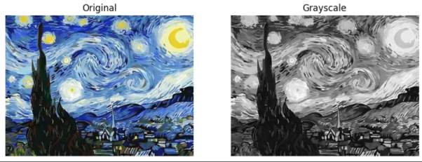
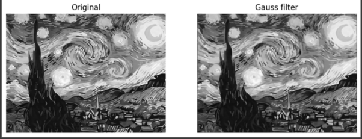
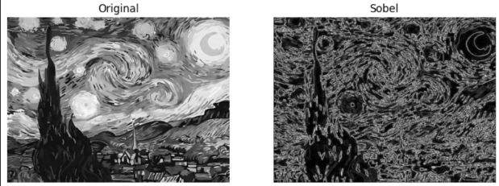
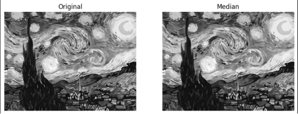

# Evaluation Activity 2: Image processing

Image processing techniques are widely used in computer vision, medical imaging, and object recognition. One essential aspect of image processing is filtering, which helps enhance important features such as edges while reducing noise. The goal of this project is to implement three fundamental filters: Gaussian filter, Sobel filter, and Median filter.  

## Description

Computational optimization significantly impacts performance, particularly in tasks involving large data processing and complex calculations. This experiment compared three implementations of the filters mentioned earlier: Pure Python, NumPy, and NumPy with Cython, measuring their execution times.

1. Gaussian Filter (Blurring & Noise Reduction)
   1. The Gaussian filter is a smoothing filter that reduces image noise and detail. It works by applying a Gaussian-weighted average to the surrounding pixels.
   1. Implementation Details:
      1. A 3×3 Gaussian kernel with σ=1 is used.
      1. The convolution operation is performed efficiently using NumPy’s vectorized operations and stride tricks.
      1. A Cython implementation further optimizes performance.
1. Sobel Filter (Edge Detection)
   1. The Sobel filter detects edges by computing the gradient magnitude of the image intensity.
   1. Implementation Details:
      1. Two 3×3 Sobel kernels (one for horizontal edges, one for vertical edges) are applied.
      1. The gradient magnitudes are calculated using NumPy operations.
      1. Cython can be used to speed up the convolution process.
1. Median Filter (Noise Removal)
   1. The Median filter is a non-linear filter used to remove salt-and-pepper noise while preserving edges.
   1. Implementation Details:
      1. A 3×3 sliding window extracts local neighborhoods.
      1. The median of each neighborhood is computed using NumPy.
      1. A Cython implementation is used to accelerate the process.

## Getting Started

### Dependencies

Ensure that you have the following libraries installed. The code is designed to run in Google Colab, but it can also work on any system with the required dependencies.

~~~bash
pip install numpy==2.0.0 pandas==1.5.3 matplotlib==3.8.1 opencv-python==4.8.0 Pillow==11.1.0 cython==3.1.0
~~~

#### Running in Google Colab
1. Open Google Colab: Google Colab
2. Upload the provided notebook (image_processing.ipynb).
3. Run the notebook cells in order.

#### Running Locally
1. Clone the repository:
~~~bash
git clone https://github.com/your-repo/image-processing.git
cd image-processing
~~~

2. Install dependencies:
~~~bash
pip install -r requirements.txt
~~~

3. Run the Jupyter Notebook.

4. Open image_processing.ipynb and execute the cells.

### Showing Final Results after applying each filter

**Gaussian filter**

**Sobel filter**

**Median filter**

## Authors

- Francisco Gabriel Chan Pech

- Carlos Eduardo Helguera Mosqueda

- Rogelio Herbert Novelo Zapata